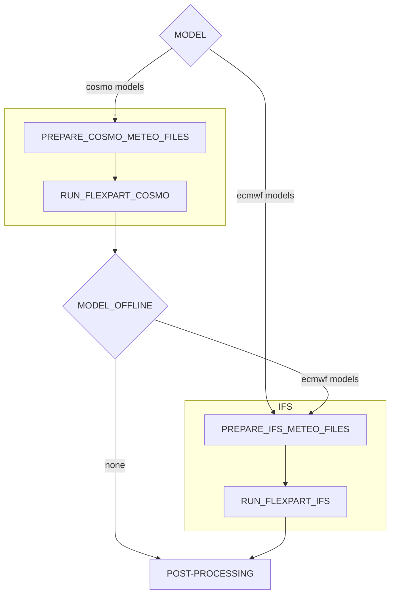
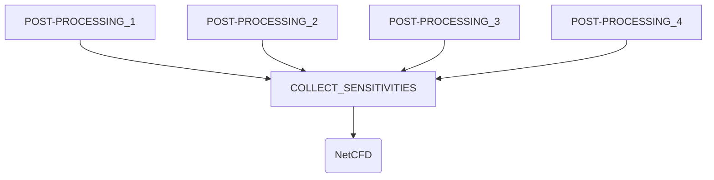
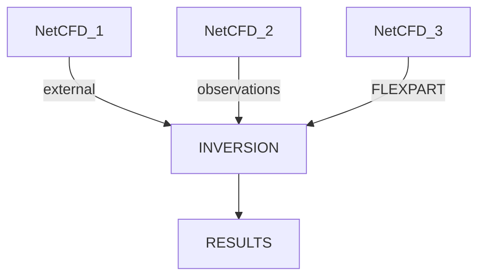

# Regional Inverse Modelling AiiDAlab App

  - [Installation](#installation)
  - [Overview](#workflow)
    - [Plugins](#installation)
    - [Wrokflow structure](#installation)
  - [Using the terminal](#in-the-terminal)
    - [Checking codes and computers]()
    - [Deleting groups]()
    - [Monitoring processes]()
    - [Generating provenance graphs]()
    - [Enable caching]()
  - [Development guide](#development-guide)
    - [Repository contents]()
    - [Getting ready]()
  - [Contact](#contact)

## Installation

Install Docker in your local machine and start a new container with:

```hs
docker run -p 8888:8888 aiidalab/full-stack
```
Check [Aiidalab user guide](https://aiidalab.readthedocs.io/en/latest/usage/index.html) for more details on how to use and configure AiiDAlab.
Once inside AiiDAlab, the app can be Downloaded from the app list in the <b>App Store</b>.

If installation was succesfull the app should look like this:

<br>

Make sure to check the first-time user's guide inside <u>Submit FLEXPART-COSMO/IFS simulations</u>

<br>

## Inversion workflow overview
### Plugins

An [AiiDAlab](https://www.aiidalab.net/) app to run FLEXPART COSMO/IFS simulations and inversions.
The app uses the aiida-flexpart plugin:

- `flexpart.cosmo`: FLEXPART COSMO transport model plugin
- `flexpart.ifs`: FLEXPART IFS transport model plugin
- `flexpart.post`: Post-processing plugin of the transport model relsults
- `collect.sensitivities`
- `inversion.calc`

A data plugin:

- `netcdf.data`: NetCDF data plugin

and 3 workflows:

- `flexpart.multi_workflow`: A workflow that can be used to submit FLEXPART calculations for multiple days
- `inspect.workflow`: Workflow for importing external NetCDF files (obesrvations or sensitivities)
- `inversion.workflow`: Workflow to submit invesions

### Workflow structure

The following is the workflow structure for the transport model. It will loop over all the given dates. If model offline is not none, integration_time_offline should be greater than zero. The available models for cosmo are: <i>cosmo7, cosmo1</i> and <i>kenda1</i>. And the ECMWF models: <i>IFS_GL_05, IFS_GL_1, IFS_EU_02</i> and <i>IFS_EU_01</i>. Both, model and model offline can be set as a list of the previous.



The second step deals withthe various results of the post-processings produced previously.



Next:



## In the terminal

More info in [AiiDA](https://aiida.readthedocs.io/projects/aiida-core/en/latest/topics/cli.html)

### Checking codes and computers
```hs
verdi computer list
```
Should display:
```
Report: List of configured computers
Report: Use 'verdi computer show COMPUTERLABEL' to display more detailed information
* daint
* daint-direct-106
* localhost
```

```hs
verdi computer show <PK>
```

```hs
verdi code list
```
Should display:
```
Full label                           Pk  Entry point
---------------------------------  ----  -------------------
flexpart_cosmo@daint                  1  core.code.installed
flexpart_ifs@daint                    2  core.code.installed
post-processing@daint                 3  core.code.installed
check-cosmo-data@daint-direct-106     4  core.code.installed
check-ifs-data@daint-direct-106       5  core.code.installed
```

```hs
verdi code show <PK>
```

### Deleting groups

```hs
verdi group list
```

```hs
verdi group delete <PK>
```

### Monitoring processes

The worflow can be monitored through the terminal using

```hs
verdi process list
```
 or

```hs
verdi process report <PK>
```
To check the status of terminated jobs use:
```hs
verdi process list -a
```

### Generating provenance graphs

```hs
verdi node graph generate <PK>
```

The graph will be stored in the current directory, go to File manager to view or donwload.

### Enable caching
Make sure caching is enabled by typing:<br>

```
verdi config list caching
```
if False, enable it with:

```hs
verdi config set caching.default_enabled True
```

## Development guide

* [`config/`](config/): Yaml files with default inputs
  * [`command.yaml`](config/command.yaml): COMMAND file inputs
  * [`input_phy.yaml`](config/input_phy.yaml): INPUT_PHY file inputs
  * [`location_groups.yaml`](config/location_groups.yaml): Groups of locations
  * [`locations.yaml`](config/locations.yaml): List of default locations
  * [`meteo_inputs.yaml`](config/meteo_inputs.yaml): 
  * [`models.yaml`](config/models.yaml): Model and offline model lists
  * [`outgrid.yaml`](config/outgrid.yaml): Default outgrids
  * [`releases.yaml`](config/releases.yaml): RELEASES file inputs
  * [`stash_files.yaml`](config/stash_files.yaml): List of files to stash for each calculations
* [`img/`](img/): Empa logo
* [`static/`](static/): CSS style file
* [`utils/`](utils/): 
  * [`default_codes.yaml`](utils/default_codes.yaml): 
  * [`make_query.py`](utils/make_query.py): 
  * [`utils.py`](utils/utils.py): 
* [`widgets/`](widgets/): 
* [`info.ipynb`](info.ipynb): Guide to set up and configure the app for first time users
* [`inversion_query.ipynb`](inversion_query.ipynb): Inversion results search page
* [`main.ipynb`](main.ipynb): FLEXPART simulation submision page
* [`ncdump.ipynb`](ncdump.ipynb): Displays NetCDF file as a ncdump
* [`plot.ipynb`](main.ipynb): Plot .png files from FLEXPART recovered results
* [`query.ipynb`](query.ipynb): Search page for FELXPART results and submitting sensitivity collection calc
* [`sens_query.ipynb`](sens_query.ipynb): page for importing NetCDF files, and submitting inversions
* [`settings.py`](settings.py): Plugins used in the app
* [`setup.cfg`](setup.cfg): 


### Setting up the enviroment

Install Docker in your local machine and start a new container with:

```hs
docker run -p 8888:8888 aiidalab/full-stack
```

Inside the container, navigate to `/app` and clone the repository.

```hs
cd app
git clone https://github.com/C2SM/aiidalab-flexpart.git
```
Necessary intallations to run the aiidalab flexpart app:

```hs
pip install aiidalab_widgets_base
pip install aiida-shell
```

The next step is to install aiida-flexpart plugin, which can be done in two ways: Using pip to install the plugin directly (recommended if changes to the plugin are not intended):

```hs
pip install aiida-flexpart
```
Alternatively, if one whises to make changes in the AiiDA flexpart plugin as well, navigate to `/work` and copy the following code. 

```hs
git clone https://github.com/aiidaplugins/aiida-flexpart.git
cd aiida-flexpart
pip install -e .
```

For the changes in this repository to be effective, merge to the main branch and push a tag. 


