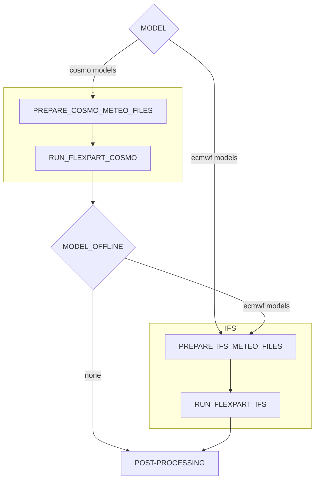
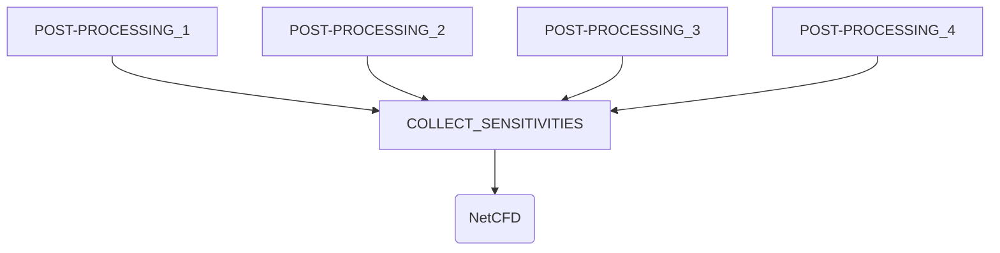
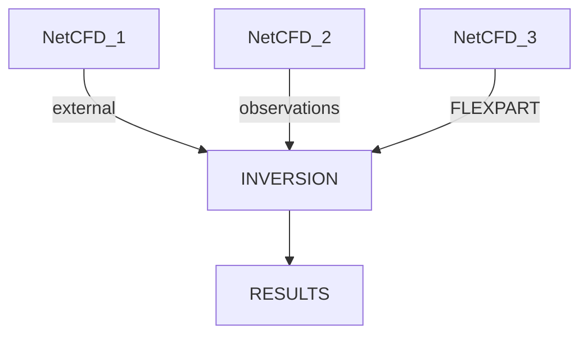

# Regional Inverse Modelling AiiDAlab App

- [AiiDA FLEXPART app](#aiida-FLEXPART-app)
  - [Installation](#installation)
    - [Computers setup](#computers-setup)
    - [Codes Setup](#codes-setup)
    - [Enable caching](#enable-caching)
  - [Workflow](#workflow)
    - [Structure](#structure)
    - [Running the workflow launcher](#workflow-launcher)
    - [Monitoring the workflow](#monitoring-the-workflow)
  - [Development guide](#development-guide)

# Aiida FLEXPART app

An [AiiDAlab](https://www.aiidalab.net/) app to run FLEXPART COSMO/IFS simulations and inversions.
The app uses the aiida-flexpart plugin:

- `flexpart.cosmo`
- `flexpart.ifs`
- `flexpart.post`
- `collect.sensitivities`
- `inversion.calc`

A data plugin:

- `netcdf.data`

and 3 workflows:

- `flexpart.multi_workflow`: A workflow that can be used to submit flexpart calculations for multiple days.
- `inspect.workflow`
- `inversion.workflow`


## Installation
Install the plugins with:
```hs
pip install -e .
```
Install [Aiida shell](https://aiida-shell.readthedocs.io/en/latest/):
```
pip install aiida-shell
```
Additional packages for Aiidalab:

```hs
pip install aiidalab-widgets-base
```
(it can also be installed through Aiidalab web)

### Computers setup
It is necessary to setup two different configurations of Daint. The configuration files are in `/config` by the names of `computer-daint.yaml` and `computer-daint-direct.yaml`. To set up the computers:

```hs
verdi computer setup --config NAME.yaml
```
followed by:

```hs
verdi computer configure core.ssh COMPUTER-NAME
```
refer to the `daint-configure.yaml` for answering the questions asked by Aiida after runnign the above line.

Finally, test the computer with:
```hs
verdi computer test COMPUTER-NAME
```

After the setup of both computers, daint and daint-direct, you can check the configuration of each by:
```hs
verdi computer list
```
Should display:
```
Report: List of configured computers
Report: Use 'verdi computer show COMPUTERLABEL' to display more detailed information
* daint
* daint-direct-106
* localhost
```
### Codes setup
Use the following line with all the <i>.yaml</i> files in `/config` that start with <i>code_</i>
```hs
verdi code create core.code.installed --config NAME.yaml
```
Similarly as with the computers, one can check the list of all the installed codes by:
```hs
verdi code list
```
Should display:
```
Full label                           Pk  Entry point
---------------------------------  ----  -------------------
flexpart_cosmo@daint                  1  core.code.installed
flexpart_ifs@daint                    2  core.code.installed
post-processing@daint                 3  core.code.installed
check-cosmo-data@daint-direct-106     4  core.code.installed
check-ifs-data@daint-direct-106       5  core.code.installed
```
<b>Note</b> that the pk numbers may differ.

### Enable caching
Make sure caching is enabled by typing:<br>

```
verdi config list caching
```
if False, enable it with:

```hs
verdi config set caching.default_enabled True
```

## Workflow

### Structure

The following is the workflow structure. It will loop over all the given dates. If model offline is not none, integration_time_offline should be greater than zero. The available models for cosmo are: <i>cosmo7, cosmo1</i> and <i>kenda1</i>. And the ECMWF models: <i>IFS_GL_05, IFS_GL_1, IFS_EU_02</i> and <i>IFS_EU_01</i>. Both, model and model offline can be set as a list of the previous.



The second step deals withthe various results of the post-processings produced previously.



Next:



#### Storage
Results will be stashed in `/store/empa/em05/{username}/aiida_stash` directory, and will include the following:

- `header*`
- `partposit_inst*`
- `grid_time_*.nc`
- `aiida.out`
- `boundary_sensitivity_*.nc` (post-processsing only)

And from the collect sensitivities calcjob:

- `<LOCATION>_<DOMAIN>_<YYYYMM>.nc`
- `aiida.out`

### Running the workflow with the launcher

The workflow can be triggered directly through a verdi command that launchs the script `example_workflow_combi.py`. The calculation inputs are
in several yaml files in `/example/inputs/`. The script reads directly from the yaml files. Some parameters, however, need to be
settled from the launcher script, e.g., simulation_dates, model, model_offline, etc.

```hs
cd aiida-flexpart/examples
verdi run example_workflow_combi.py --code flexpart-cosmo@daint
```
### Monitoring the workflow

The worflow can be monitored using

```hs
verdi process list
```
 or
```hs
verdi process status PK
```
To check the status of terminated jobs use:
```hs
verdi process list -a
```

## Development guide

* [`config/`](config/): Yaml files with default inputs
  * [`command.yaml`](config/command.yaml): COMMAND file inputs
  * [`input_phy.yaml`](config/input_phy.yaml): INPUT_PHY file inputs
  * [`location_groups.yaml`](config/location_groups.yaml): Groups of locations
  * [`locations.yaml`](config/locations.yaml): List of default locations
  * [`meteo_inputs.yaml`](config/meteo_inputs.yaml): 
  * [`models.yaml`](config/models.yaml): Model and offline model lists
  * [`outgrid.yaml`](config/outgrid.yaml): Default outgrids
  * [`releases.yaml`](config/releases.yaml): RELEASES file inputs
* [`img/`](img/): Empa logo
* [`static/`](static/): CSS style file
* [`utils/`](utils/): 
  * [`default_codes.yaml`](utils/default_codes.yaml): 
  * [`make_query.py`](utils/make_query.py): 
  * [`utils.py`](utils/utils.py): 
* [`widgets/`](widgets/): 
* [`info.ipynb`](info.ipynb): Guide to set up and configure the app for first time users
* [`inversion_query.ipynb`](inversion_query.ipynb): Inversion results search page
* [`main.ipynb`](main.ipynb): FLEXPART simulation submision page
* [`ncdump.ipynb`](ncdump.ipynb): Displays NetCDF file as a ncdump
* [`plot.ipynb`](main.ipynb): Plot .png files from FLEXPART recovered results
* [`query.ipynb`](query.ipynb): Search page for FELXPART results and submitting sensitivity collection calc
* [`sens_query.ipynb`](sens_query.ipynb): page for importing NetCDF files, and submitting inversions
* [`settings.py`](settings.py): Plugins used in the app

